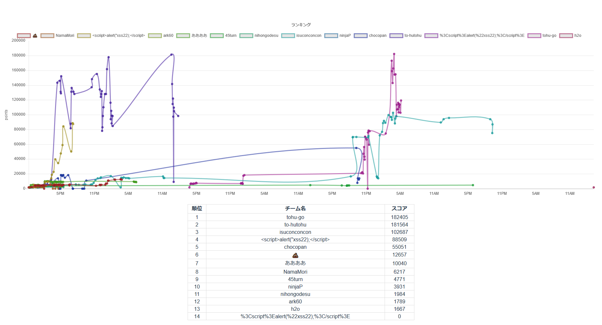
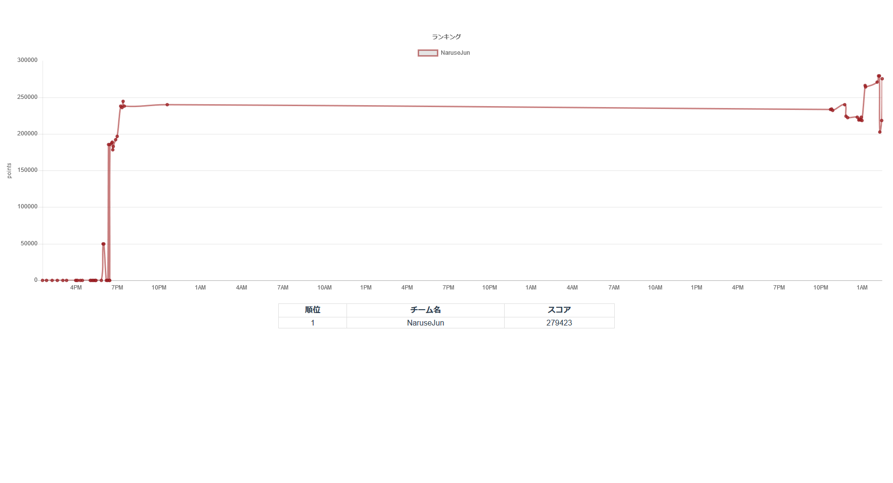
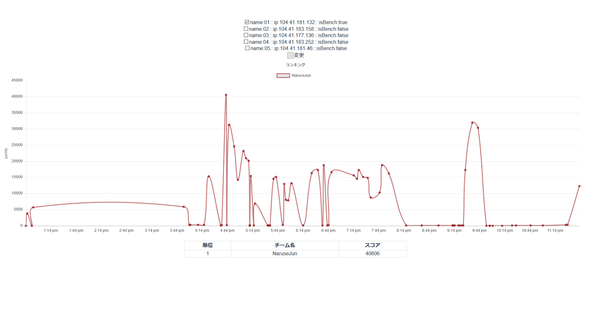
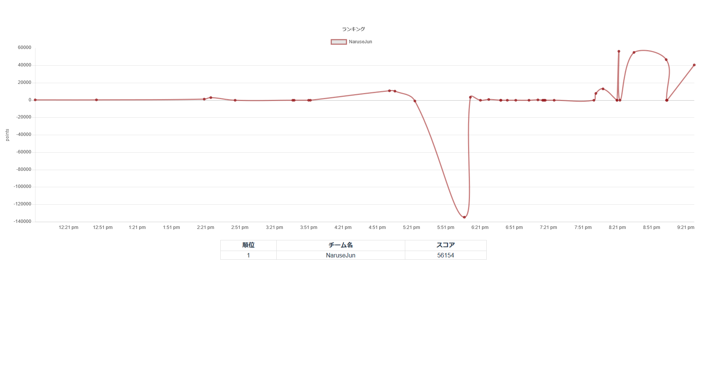

# ISUCON7本戦に参加してきました(惨敗)
11月25日にLINE本社で行われたISUCON7本戦にチームNaruseJunとして参加してきました。(学生枠)
予選は先輩の@kaz @nariと3人で参加したのですが、本戦の日は@nariがコードフェスティバルの方に参加してたので@kazと二人でLINEに乗り込みました。

結果は最高スコア14000点ほど、最終スコア8000点でフィニッシュ。全体20位で惨敗でした…
悔しさを噛み締め来年に活かすために、予選が終わった後から書いていきたいと思います。
本戦で使用した言語はGoです。

## 予選から本戦まで
予選までは全く準備をしていませんでしたが、本戦はガチでやろうということで練習会を4回行いました。
出来る限り実際に行われた状況と同じスペックでできるように設定して練習しました。
ベンチマーカー等のことはまた別記事で書こうと思います。

### pixivさんの社内ISUCON
部内で一緒に練習する人を募ったら20人位集まって、学校の図書館で集まって行いました。
俺は運営側だったので途中から参戦でした。
一度解いたことのある問題だったのでかなり重めのキャッシュの実装まで手を付けることができ、結果はダントツの1位。

結果(競技終了後も鯖を開放していたので改善してる人が多い)
この練習会の後に本戦をGoでやることになったのでGo言語で1位を奪取しました。

### ISUCON6 予選
テスト期間が近くなっていたので参加者がおらず、@kazともう一人と3人で実施。
27万点くらい取れてます。

### ISUCON6 本戦
本番に向けてitamaeでプロビジョニングを行えるようにスクリプトを書きつつ実施しました。
複数台構成に慣れておらず結構手間取りました。
Max4万点

### ISUCON5 本戦
期末期間の真っ只中に実施。
ベンチマーカーにバグが有って(というか変更があって)最初にベンチマークを行うことができませんでした。
それと戦いつつやった結果Max5万点ほど。

四回の練習で最初に実行するitamaeのレシピ(公開鍵の設置 Go1.9 PHPのインストール kataribe PHPMyAdmin エイリアス等の設定をしてくれる)、PHPでGitea(部内のGitホスティングサービス)のWebHookでデプロイしその結果をSlackに投稿するシステムを作りました。
デプロイシステムは特に複数台の場合一気に変更を反映させられて便利だったので準備しておくことをおすすめしたいです。

## 当日
### 競技開始まで

会場のミライナタワー
会場着いたらもう@kazが来ていました。 案の定、俺と@kazはサークルのポロシャツ+パーカーでペアルックでした。 受付で、めっちゃかっこいい参加者カードを貰い、これだけでだいぶテンションが上がる。

トイレに行ったり、Twitterしたりしつつ時間を潰します。
当日のリポジトリを作ったりHackMDにメモ用のノートを作ったりもしていました。

時間が来て、恒例らしい問題の提示が行われました。
みんなネタに笑っていたりしてとてもいい雰囲気でした。
競技開始までマニュアルを読みます。
練習で見た、マニュアルよりめちゃくちゃページ数が多くてビビりましたが、二人で内容を確認しながら読み進めていきました。
今回の問題はクッキークリッカーっぽいゲームを複数人で一緒に遊べるようにしたものです。
静的ファイルの配信が点数に入らないというところが結構びっくりしました。

### 競技中
競技開始後、すぐにベンチマークを回しましたが4番手でした。
初期スコア： 7294点

itamaeを走らせ、環境を準備していきます。
@kazがデプロイシステムの準備をしている間にwebapp以下をtarに固めてローカルにバックアップ、db以下も同様に行いました。
gitリポジトリにソースコードを追加、プッシュ。
ローカルでビルドできるようにしている間にデプロイシステムの準備ができたので、二人でとりあえずゲームを遊んでみました。

その後実装言語をGoに変更しベンチマーク。
6200点くらい。

Consistent Hashという手法を使えば、部屋ごとにサーバーを分けることができるということを@kazが思いついたけど、それを実装する前に1サーバーで改善していこうという方針に。

ItemをDBから剥がす。
1サーバーで5000点

pprofを導入して、ベンチマークを回しボトルネックを探します。
ステータスを計算している部分にかなりの処理時間がかかっていました。
多倍長整数の計算が重たいようです。

ここで私がこちらからstatusを送っていない間もクライアント側では線形にISUが増えるのだから、ステータスが変わらない間はこちらからstatusを送らなくても良いのでは？と提案し実装します。
これはベンチマークをパスしてめちゃくちゃ効果があるのでは？と思って点数を見たのですが逆に点数は落ちていました。
その時は原因がわからなかったんですが、競技終了後に話している時に気づきました。
ベンチマーカーは初期実装の500msより短い間隔でステータスの変更が来るので、その度にステータスを計算していたのでは500ms秒ごとに計算するよりも無駄だったという…

そんなことは知る由もないので、その変更は取り入れられたまま4台構成に変更します。
順当に得点が4倍になり、12000点ほどに。
mysqlの設定などを変更しここでmaxの14000点を記録。
この時点で2時半ごろでした。

pprofの解析を見ると30秒の計測の内27秒ほどがステータスの計算に使われていました。
そこで二人でステータス計算の最適化を行うことにします。
前回計算時のsheduleから差分を計算することで、大幅に計算量を減らすという算段でした。
しかし、AddingもBuyingも一緒に計算しようとするとかなり大規模な変更になってしまい3時間位かけましたが結局断念。

17時40分頃から1台に集中していたMysqlを4台に分散し、Unixドメインソケットで接続するように変更。
ここで、そこまで部屋数が多くなく運次第で上手く4台に分散しないことが発覚。
ベンチガチャを回し続け競技終了。

### 懇親会
ISUCONの情報を得るために読んだブログを書いている人がたくさん目の前にいて感動しました。
そして、🍣と🍕と🍺！！
本当に美味しかったです。

作問者の方とお話をさせていただきました。
予選の方は私達学生にかなり配慮して、N+1問題やキャッシュなどの王道のボトルネックを入れるようにしていたそうです。
その分本戦は容赦をしない問題にしたそうです。(まんまとやられてしまいました)

優勝したMSAの皆さんの方針を聞くと、自分たちと同じGoでも力の差を感じさせられました。
アロケーションを減らすだけでそんなに処理時間が変わったのか～と思って後悔。
差分計算がうまくいっていればかなりの高得点が出たのではないかと二人で悔しがっていました。

途中で行われたじゃんけん大会でLINEから出ているスマートスピーカーのClova waveをいただきました。
帰ってからすぐに開けて、大活躍しています。
今もこの記事を書いている隣でLINE Musicが流れています。

## まとめ
実際に操作するのとベンチマーカーでの挙動の差をしっかりと考察できず泣いたという感じでした。
変更を加えたあとの得点の変動の理由もちゃんと考察をするべきでした。
またかなり@kazにおんぶにだっこで自分の力不足も目立った気がします。
もっとGoを素早く正確に読み書きできるようになっておく必要があったなと思います。
本当に悔しい。

運営・作問者の皆さんとてもいい経験になるイベント、問題をありがとうございました！
実際に現場で活躍してるエンジニアの皆さんと同じ問題を同じ時に解くのは言葉に出来ない興奮と感動がありました。
しかもタダで🍣と🍕と🍺が！
学生の皆さんでサーバーのスピードアップに興味がある人はぜひ来年参加しましょう！！

来年は絶対に勝ちたい…
精進します…
