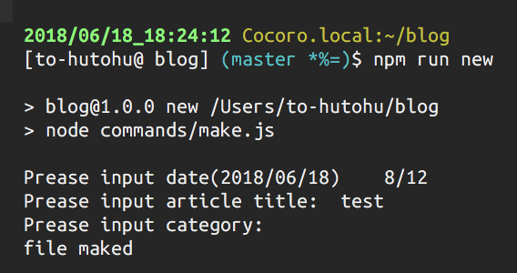

# VuePressに移行した 0.10.0対応版
VuePressは現在も開発が活発でバシバシアップデートが入っています。
私がVuePressに移行したときからバージョンも上がったので、現在の最新版である0.10.0に対応してみました。

前回の記事
[VuePressに移行した | とーふとふのブログ](/2018/05/18/migrate-to-vuepress/)

`vuepress eject`をするとejectされるファイルはすべて上書きされてしまいます。
そこで前回の変更を独自のファイルに切り出していきます。

## スタイル
PCでの表示のときにはサイドバーを右に、スマホ表示のときはハンバーガーボタンを押すと左からサイドバーが出てくるようにします。

stylesフォルダの中にmy-custom.stylファイルを作成します。

```stylus
@require './config'

@media (min-width: ($MQMobile + 1px))
  .page
    padding-right $sidebarWidth // leftをrightに変更
    padding-left 0 // leftをrightに変更
  .sidebar
    right 0  // leftをrightに変更
    left initial
    border-right 1px solid $borderColor // 追加
```

そしてtheme.stylの最下部でrequireします。

## サイドバー
これまでの記事がある月一覧を表示するようにします。
srcフォルダの中にcustomというフォルダを作ってその中に各種ファイルを作るようにします。

util.js

```javascript
export function resolveSidebarItems (page, route, site, localePath) {
  let pages = site.pages
  const list = []
  pages.forEach(pa => {
    let pathList = pa.path.split('/').filter(p => p !== '')
    if (pathList.length > 2) {
      pathList = pathList.slice(0, 2)
    }
    let tmp = list
    let nowPath = ''
    let now
    pathList.forEach((name, i) => {
      nowPath = nowPath + '/' + name
      now = tmp.find(e => e.path === nowPath + '/')
      if (!now) {
        tmp.push({
          type: (i===1?'auto':'group'),
          title: name,
          path: (nowPath + '/'),
          collapsable: true,
          children: []
        })
        now = tmp.find(e => e.path === nowPath+'/')
      } 
      tmp = now.children
    })
  })
  return [page, ...list]
}
```

Layout.vueの中身で`@app/util`の代わりにこのファイルを読むことにします。


## ブログ機能
他のブログ生成ツールっぽく新しい記事を作成できるようにしてみます。
下のファイルを./commands/make.jsとして作成し、package.jsonにコマンドを追加します。

```javascript
const moment = require('moment')
const chalk = require('chalk')
const mkdirp = require('mkdirp')
const fs = require('fs')
const readline = require('readline-sync')
const print = text => {
  process.stdout.write(text)
}
const println = console.log

const lines=[];

const waitInput =  () => {
  return readline.question()
}

const inputDate = async () => {
  let date = moment()
  let OK = false
  while (!OK){
    print(`Prease input date(${date.format('YYYY/MM/DD')})    `)
    try {
      const tmp = await waitInput()
      if (tmp === '') {
        OK = true
        break
      }
      date = moment(tmp, 'M/D')
      OK = date.isValid()
    } catch (e) {

    }
  }
  return date
  
}

const inputTitle = async () => {
  print('Prease input article title:  ')
  return await waitInput()
}

const inputCategory = async () => {
  print('Prease input category:  ')
  return await waitInput()
}

const init = async () => {
  const date = await inputDate()
  const title = await inputTitle()
  const category = await inputCategory()
  const dirPath = './src/' + date.format('YYYY/MM/DD/') + title
  const yearListPath = './src/' + date.format('YYYY') + '/index.md'
  const monthListPath = './src/' + date.format('YYYY/MM')+ '/index.md'
  const filePath = dirPath + '/index.md'
  mkdirp.sync(dirPath, 0755)

  const listTemplate = fs.readFileSync('./commands/list-template.md').toString('utf-8')
  fs.writeFileSync(yearListPath, listTemplate.replace(/{{time}}/g, date.format('YYYY') + '年'))
  fs.writeFileSync(monthListPath, listTemplate.replace(/{{time}}/g, date.format('M') + '月'))

  const template = fs.readFileSync('./commands/index-template.md').toString('utf-8')

  const index = template.replace(/{{title}}/g, title).replace(/{{category}}/g, category)
  fs.writeFileSync(filePath, index)
  console.log('file maked')
  process.exit(0)
}
init()
```

下の画像のように新しく記事を追加できるようになります。

