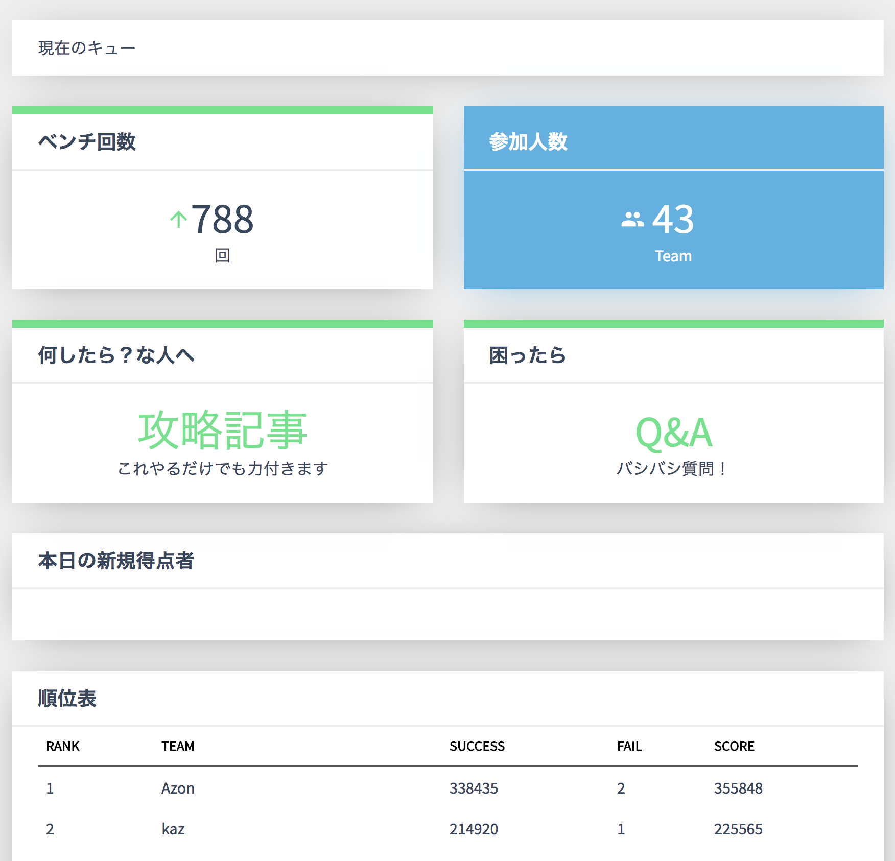

# PISCONポータルを作った
大学で所属しているサークルの方で、SysAd班に配属になったので新入生や初心者の経験のために部内ISUCON、通称PISCONを開催することにしました。

部内でのISUCON練習会は去年も何回か開催してたんですが、その時はベンチマークのは鯖からCurlでリクエストして開始で、ランキングとかもめっちゃ簡素なものにしていました。
今回はかなり人数も多いし、長期間やることになりそうだったのでちょっと真面目に作ってみようということで3日位で作りました。

リポジトリはこちら→ [tohutohu/isucon-portal-go](https://github.com/tohutohu/isucon-portal-go)

## 構成
所属しているサークルにはShowcaseという簡易PaaSみたいなものがあって、それにはサークルメンバーがアクセスしてきた時にあるレクエストヘッダにメンバーのIDが書き込まれて簡易的にシングルサインオン的機能を実装できるようになってます。
しかし、それが動いてる鯖は他のメンバーのアプリケーションもたくさんあってバカスカベンチマークを走らせるのは難しいので、実際の処理は基本的に別サーバーで行い、Showcase上のアプリケーションはプロキシ的に使うことにしました。

クライアントはVue.js+Vue Adminを使いました。
こういう時にUIフレームワークを使うと手軽にそれっぽい画面ができて良いですね。部内向けなのでデザインも凝らなくていいですし。

つまりこんな感じ

クライアント-部内認証システム(JWT)→Showcase(部内)-JWT→ベンチマークサーバー→各参加者のインスタンス

## インスタンスの作成
昨年のISUCON練習会のときは事前に参加者を集めて、それに合わせてインスタンスの作成を手動で行っていたのですが、今回は期間も長くやる予定だし個人的に連絡をしてもらうのも参加するハードルをあげてしまうということでポータルサイトでワンクリックで簡単に作れるようにしました。

今回使ったサービスのConohaではOpen Stack API互換のAPIを利用できるので、[gophercloud/gophercloud](https://github.com/gophercloud/gophercloud)を使ってインスタンスの作成を行いました。

```go
type ConohaClient struct {
    client *gophercloud.ProviderClient
}

func New(opts gophercloud.AuthOptions) *ConohaClient {
	c := &ConohaClient{}
	fmt.Println(opts)
	client, err := openstack.AuthenticatedClient(opts)
	if err != nil {
		panic(err)
	}
	c.client = client
	return c
}

func (c *ConohaClient) MakeInstance(name, pass string) error {
	eo := gophercloud.EndpointOpts{
		Type:   "compute",
		Region: "tyo1",
	}
	compute, err := openstack.NewComputeV2(c.client, eo)
	if err != nil {
		panic(err)
	}

	startUpScript := fmt.Sprintf(`#!/bin/sh
useradd -m -G sudo -s /bin/bash isucon
echo isucon:%s | /usr/sbin/chpasswd
sed -e "s/PermitRootLogin yes/PermitRootLogin no/g" -i /etc/ssh/sshd_config
sed -e "s/#PermitRootLogin yes/PermitRootLogin no/g" -i /etc/ssh/sshd_config
sed -e "s/#PermitRootLogin no/PermitRootLogin no/g" -i /etc/ssh/sshd_config
systemctl restart sshd	
	`, pass)

	copts := servers.CreateOpts{
		Name:      "isucon",
		ImageRef:  "6bf41f8b-0579-45f9-abe5-37fbff5f964c",
		FlavorRef: "7eea7469-0d85-4f82-8050-6ae742394681",
		Metadata: map[string]string{
			"instance_name_tag": name,
		},
		SecurityGroups: []string{},
		UserData:       []byte(startUpScript),
	}
	r := servers.Create(compute, copts)
	if r.Err != nil {
		return r.Err
	}
	return nil
}
```

インスタンスを作成した後、インスタンスの情報を取得しDBにIPアドレスやインスタンスIDを保存します。

```go
func (c *ConohaClient) GetInstanceInfo(instanceName string) (*servers.Server, error) {
	list, err := c.InstanceList()
	if err != nil {
		return nil, err
	}
	for _, server := range list {
		fmt.Println(server.Metadata["instance_name_tag"])
		if server.Metadata["instance_name_tag"] == instanceName {
			return &server, nil
		}
	}
	return nil, errors.New("Not Found")
}
```

## ベンチマーク
ベンチマークも昨年はインスタンスからcurlをしてもらうことで、実行していたのですがポータルからベンチマークを開始できるようにしました。

ベンチマーク情報はDBに一度保存して、ベンチマークの途中でサーバーが終了してもキューが壊れないようにしました。


## 画面
そして完成したものがこちら

[Piscon portal](http://isucon-portal.to-hutohu.trap.show/#/dashboard)
👆期間限定サイトなのですでに消えているかもしれません

### トップ画面


### ランキング画面


### Q&A画面


PISCONの開催報告自体は https://trap.jp の方で記事が上がると思います。多分。
SysAd班に所属した人たちがこれを通して少しでも強くなってくれることを期待しています。
