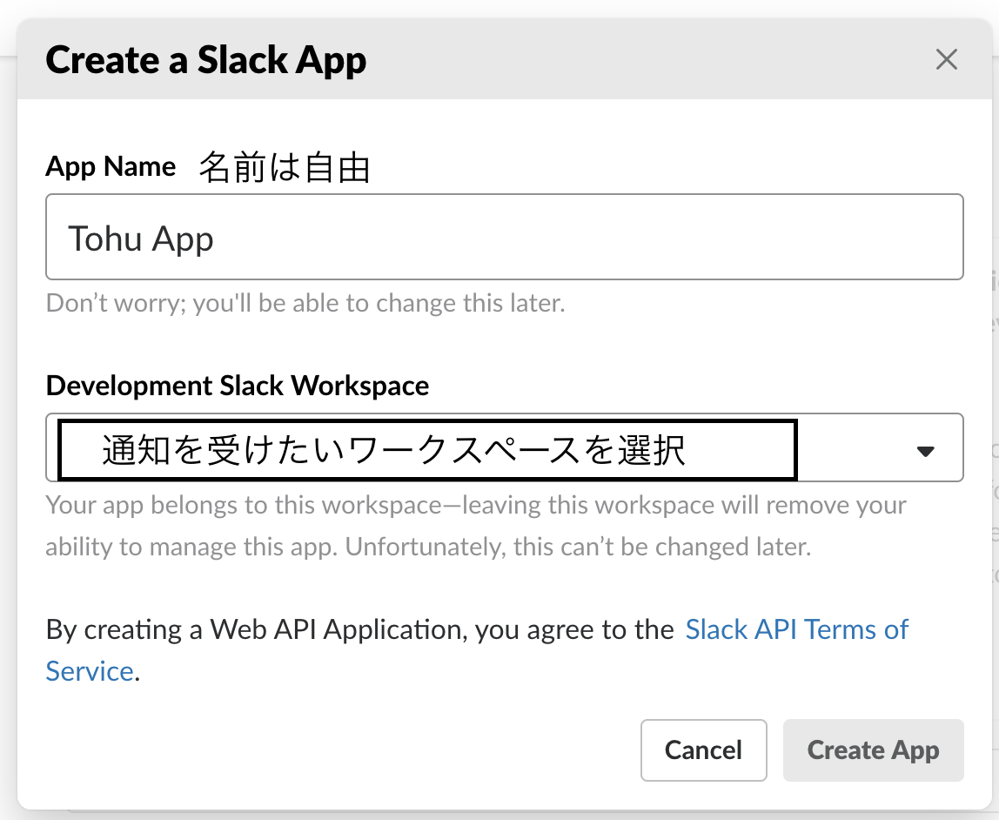

# VuePressにNetlify Formsを使ってコメント機能を追加する
この冬休みはずっとVuePressを使ったこのブログの改造をしていたのですが、そのうちの一つとしてNetlifyへの移行がありました。(これまでは自作の自動デプロイツールを使っていた)
Netlifyへの移行自体はとても簡単で、ビルドやデプロイも勝手にやってくれるのでとても楽になりました。
デプロイ完了に合わせてメールやSlackに通知してくれる機能がデフォルトであるのもいいですね。

Netlifyへの移行をしたということもあり、機能を使い倒してみようということでNetlify Formsという機能を使ってこのブログにコメント機能を追加してみたので、作業手順をまとめてみました。

機能の流れとしてはこんな以下のとおりです。
- コメントする
- 承認待ちコメントキューに追加される
- Slackに承認・非承認のボタンがついたメッセージが飛ぶ
- 承認ボタンを押す
  - 承認待ちコメントキューから承認済みコメントリストに移動
  - 再デプロイされ、コメントが投稿された状態でサイトがデプロイされる
- 非承認ボタンを押す
  - 承認待ちコメントキューからコメントを削除

Netlifyは静的サイトのデプロイ・配信サービスなのでサーバーアプリケーションを動かすことはできません。
そこで、サイトのビルド時にコメントを取ってきてJSONにし、それを使ってコメントのレンダリングを行っています。

## Netlify Formsとは
Netlifyが提供しているフォームのサービスです。
フォームのPOSTを受け取るサーバーアプリケーションの必要なく、静的サイトにFormを設置することができます。
サイトのデプロイ時に、HTMLを解析しNetlify側で自動でデータベースを作ってくれるようです。
デフォルトでも簡易なスパムフィルタリングが適用され、アカウントを連携させればre-CHAPTAを使用することもできます。

フォームの投稿の通知もSlackやメール、Zaiperを使ったほかサービスとの連携も可能で簡単なお問い合わせフォームとしては十分使える物となっていると思います。

## VuePressにコメント機能を追加する手順
大まかな手順は以下の通りです。
1. コメント投稿フォームの設置
2. 承認済みコメント用フォームの設置
3. Slack Appの作成
4. lambda functionの作成
6. コメントを取得するプログラムの作成
7. コメントデータを各ページに追加
9. コメントの表示
8. 各種設定

それでは手順にしたがってまとめていきます。

## 1. コメント投稿フォームの設置
VuePressにコメント投稿用のコンポーネントを作成し、フォームを設置したいページ(またはそのページのレイアウト)に追加します。

### コード例
```vue
<template>
  <details class="send-comment-container">
    <summary>
      <span class="send-comment">コメントする</span>
    </summary>
    <form 
      name="suspendedComments"
      method="post"
      netlify
      netlify-honeypod="bot-field"
    >
      <div class="form-name">
        <div class="label" for="name">Name:</div>
        <input type="text" name="name" id="">
      </div>
      <div class="form-email">
        <div class="label" for="email">E-mail:</div>
        <input type="email" name="email" id="">
      </div>
      <div class="form-content">
        <div class="label" for="content">Content:</div>
        <textarea name="content" id="" cols="30" rows="10"></textarea>
      </div>
      <input type="hidden" name="pageKey" :value="$page.key">
      <input type="hidden" name="path" :value="$route.path">
      <input type="hidden" name="form-name" value="suspendedComments">
      <div>コメントは承認されると表示されます</div>
      <input type="submit" value="Send">
    </form>
  </details>
</template>

<script></script>
<style></style>
```

ここで注意すべき点は以下の箇所です。
```vue
<form 
  name="suspendedComments"
  method="post"
  netlify
>
  <input type="hidden" name="form-name" value="suspendedComments">
</form>
```
- formの`name`属性でフォームの名前を指定すること
- formのmethodは`post`にすること
  - 指定しなかった場合ページ遷移後にsubmitした時エラーになります
- form要素に`netlify`属性を追加すること
  - `netlify`属性を追加することでFormsが有効化されます
- form内に`type="hidden" name="form-name"`のinput要素を追加し`value`属性でフォームの名前を指定すること
  - **これが一番大事**
    Netlify Formsではビルド後のHTMLを解析し、`netlify`属性のあるフォームにこの要素を追加するようなのですが、自分で予め書いておくことで勝手に追加されるのを抑制できます。
    これを書かなかった場合`DOMException: Failed to execute 'appendChild' on 'Node': This node type does not support this method.`というエラーが発生し、ページ遷移が行えなくなります

以上の四点を満たす必要があります。

## 2. 承認済みコメント用フォームの設置 
1で承認待ちコメントのリストは作成されましたが、承認済みコメントのリストは作成されていません。
そこで、publicフォルダにリスト作成用のHTMLファイルを作成します。

```html
<!DOCTYPE html>
<html lang="en">
<head>
  <meta charset="UTF-8">
  <meta name="viewport" content="width=device-width, initial-scale=1.0">
  <meta http-equiv="X-UA-Compatible" content="ie=edge">
  <title>Document</title>
</head>
<body>
  <form name="approvedComments" method="post" netlify netlify-honeypod="bot-field">
    <input type="text" name="name">
    <input type="email" name="email">
    <textarea name="content" id="" cols="30" rows="10"></textarea>
    <input type="text" name="recieved" id="">
    <input type="hidden" name="pageKey">
    <input type="hidden" name="form-name" value="approvedComments">
    <input type="hidden" name="path">
  </form>
</body>
</html>
```

これをデプロイすることで、`approvedComments`という名前のリストが作成されます。(1つデータが挿入されるまでは管理ページから見ることはできません)

## 3. Slack Appの作成
Slack Appを作成するページ([Slack API: Applications | Slack](https://api.slack.com/apps?new_app=1))へ行き、新しくアプリを作成します。


作成したあと、サイドバーのFeaturesからInteractive Components, Incoming Webhookを有効化します。

Interactive ComponentsでのRequest URLは`https://{site url}/.netlify/functions/comment-approve`(あとで作成するlambda functionのファイル名)とします。

## 4. lambda functionの作成
Netlifyは指定したディレクトリ以下にあるファイルを、自動でAWSのlambda functionにデプロイしてくれる機能があります(しかもAWSアカウント不要！)
今回はこの機能を利用して、Slackへメッセージを送るようにします。
Netlifyの通知機能でもSlackにメッセージを送ることができますが、承認するかのボタンを付けたりして送りたいのでこちらを使います。

### netlify-lambdaのインストール
Netlifyにlambda関数をデプロイするにあたって便利なビルドツールがあります。
[netlify/netlify-lambda](https://github.com/netlify/netlify-lambda)
今回もこれを利用します。

```
npm install netlify-lambda
```

### コメントを受けてSlackにメッセージを送る関数
comment-recieve.js
```javascript
var request = require("request");

exports.handler = function(event, context, callback) {

  // get the arguments from the notification
  var body = JSON.parse(event.body);

  // prepare call to the Slack API
  var slackURL = process.env.SLACK_WEBHOOK_URL
  var slackPayload = {
    "text": "New comment on " + process.env.URL,
    "attachments": [
      {
        "fallback": "New comment",
        "color": "#444",
        "author_name": body.data.name + ' ' + body.data.email,
        "title": body.data.path,
        "title_link": process.env.URL + body.data.path,
        "text": body.data.content
      },
      {
        "fallback": "Manage comments on " + process.env.URL,
        "callback_id": "comment-action",
        "actions": [
          {
            "type": "button",
            "text": "Approve comment",
            "name": "approve",
            "value": body.id
          },
          {
            "type": "button",
            "style": "danger",
            "text": "Delete comment",
            "name": "delete",
            "value": body.id
          }
        ]
      }]
  };

  // post the notification to Slack
  request.post({ url: slackURL, json: slackPayload }, function (err, httpResponse, body) {
    var msg;
    if (err) {
      msg = 'Post to Slack failed:' + err;
    } else {
      msg = 'Post to Slack successful!  Server responded with:' + body;
    }
    callback(null, {
      statusCode: 200,
      body: msg
    })
    return console.log(msg);
  });
}
```

こちらはただフォームから来たWebhookをSlackに流しているだけです。

### Slackでボタンを押した結果を受ける関数
comment-approve.js
```javascript
var request = require("request");

function purgeComment(id) {
  var url = `https://api.netlify.com/api/v1/submissions/${id}?access_token=${process.env.API_AUTH}`;
  request.delete(url, function (err, response, body) {
    if (err) {
      return console.log(err);
    } else {
      return console.log("Comment deleted from queue.");
    }
  });
}


/*
  Handle the lambda invocation
*/
exports.handler = function (event, context, callback) {

  // parse the payload
  var body = event.body.split("payload=")[1];
  var payload = JSON.parse(unescape(body));
  var method = payload.actions[0].name
  var id = payload.actions[0].value

  if (method == "delete") {
    purgeComment(id);
    callback(null, {
      statusCode: 200,
      body: "Comment deleted"
    });
  } else if (method == "approve") {

    // get the comment data from the queue
    var url = `https://api.netlify.com/api/v1/submissions/${id}?access_token=${process.env.API_AUTH}`;

    console.log()


    request(url, function (err, response, body) {
      if (!err && response.statusCode === 200) {
        var data = JSON.parse(body).data;

        // now we have the data, let's massage it and post it to the approved form
        var payload = {
          'form-name': "approvedComments",
          'path': data.path,
          'pageKey': data.pageKey,
          'received': new Date(),
          'email': data.email,
          'name': data.name,
          'content': data.content
        };
        var approvedURL = process.env.URL;

        console.log("Posting to", approvedURL);
        console.log(payload);

        // post the comment to the approved lost
        request.post({
          url: approvedURL, 
          headers: {
            "Content-type": "application/x-www-form-urlencoded",
          },
          form: payload 
        }, function (err, httpResponse, body) {
          var msg;
          if (err) {
            msg = 'Post to approved comments failed:' + err;
            console.log(msg);
          } else {
            msg = 'Post to approved comments list successful.'
            console.log(msg);
            purgeComment(id);
          }
          var msg = "Comment registered. Site deploying to include it.";
          callback(null, {
            statusCode: 200,
            body: msg
          })
          return console.log(msg);
        });
      }
    });
  }
}
```
`API_AUTH`には[Create a new personal access token](https://app.netlify.com/account/applications/personal)で発行できるAPIトークンを環境変数として設定します。

アクションが`delete`/`approve`のどちらかによって異なる動作をします。
- `delete`の場合、ただ削除します
- `approve`の場合、承認済みコメントのリストに追加し承認待ちからは削除します

### ビルドする
サイトのリポジトリのルートに`netlify.toml`というファイルを作成し、設定を記入します。
```toml
[build]
  functions = './lambda-dist'
```

これでビルドを行うと`{root}/lambda-dist/`ディレクトリにビルドされた生成物が吐き出されます。

`package.json`のスクリプトに追加しておきましょう。
```javascript
{
  …
  "scripts": {
    "build:lambda": "netlify-lambda build lambda"
  }
  …
}
```

### デプロイ設定を行う
Site Setting > Functions からlambda functionをデプロイするディレクトリを指定します。

## 5. コメントの取得
```javascript
const request = require('request')
const fs = require('fs')
const path = require('path')

const formsUrl = `https://api.netlify.com/api/v1/forms?access_token=${process.env.API_AUTH}`;
request(formsUrl, (err, res, data) => {
  const id = JSON.parse(data).find(e => e.name === 'approvedComments').id
  const url = `https://api.netlify.com/api/v1/forms/${id}/submissions/?access_token=${process.env.API_AUTH}`;

  request(url, (err, res, data) => {
    if (err) {
      console.log(err)
      return
    }
    const jsonData = JSON.parse(data)
    const writeData = {}
    jsonData.forEach(e => {
      if (!Array.isArray(writeData[e.data.pageKey])) {
        writeData[e.data.pageKey] = []
      }
      writeData[e.data.pageKey].push( {
        name: e.data.name,
        content: e.data.content, 
        date: e.created_at
      })
    })

    fs.writeFileSync(path.resolve(__dirname, '../src/.vuepress/_data/comments.json'), JSON.stringify(writeData))
  })
})
```

これを実行することで`comments.json`に`pageKey`をキー、コメントの配列を値としたオブジェクトのファイルが生成されます。

## 6. コメントデータを各ページに追加
VuePressのプラグイン機能を利用して、コメントデータを各ページのメタデータに追加します。

##### plugins/comments.js
```javascript
const comments = require('../_data/comments.json')

module.exports = (options, ctx) => {
  return {
    extendPageData($page) {
      $page.comments = comments[$page.key] || []
    }
  }
}
```

##### config.js
```javascript
module.exports = {
  plugins: [
    require('./plugins/comments.js')
  ]
}
```

## 7. コメントデータの表示
コメントデータを表示します。
テンプレートだけ

```vue
<template>
  <div class="comments">
    <h3>Comments</h3>
    <div class="comments-container">
      <div v-for="(comment, idx) in $page.comments" :key="idx">
        <hr>
        <div class="first-line">
          <div class="name">{{comment.name}}</div>
          <p class="date">{{comment.date | format}}</p>
        </div>
        <div class="comment-content">{{comment.content}}</div>
      </div>
    </div>
  </div>
</template>

<script>
import CommentsForm from './CommentForm.vue'
export default {
  components: {CommentsForm},
  filters: {
    format(val) {
      return (new Date(val)).toLocaleString()
    }
  }
}
</script>
```

## 8. 各種設定
NetlifyのWebコンソールから設定を行います。

### Build hooksの追加
Site Settings > Build & deploy > Build hooks からビルド用のWebhookを追加します。

ここで生成されたURL(ランダムな文字列です)は下のForm notificationで使用します。

### Form notificationsの追加
Site Settings > Forms > Form notificationsから2つ追加します。
1. 承認待ちコメントリストに追加されたときに先程作成したlambda関数(comment-recieve)にPOSTする
2. 承認済みコメントリストに追加されたときに先程作成したBuild hooksのURLにPOSTする

### 環境変数の追加
3つの環境変数を追加します
- `API_AUTH`: NetlifyのAPIトークン
- `SLACK_WEBHOOK_URL`: Slack AppのIncoming Webhook URL
- `URL`: サイトのURL

### build commandの変更
Site Setting > Build & deploy > Build settings からBuild Commandを変更し、netlify-lambdaでのビルド、コメントの取得を先に行うように変更します。

## まとめ
以上です。
ここまでをうまくやってデプロイすれば、自分のサイトにコメント機能を追加できるはずです。

もし途中でわからない点があったら、下のコメント機能やTwitterで質問してください。
メールアドレスは入力しなくても送信できますが、返信をするときに通知できるのでもしよければ記入してください。

結構手軽にできたはずなんですが、僕自身も年末から昨日までつきっきりでやっていました。
いい冬休みの自由研究になったと思います。

## 参考にしたサイト
- [Forms | Netlify](https://www.netlify.com/docs/form-handling/)
- [How to Integrate Netlify Forms in a Vue App | Netlify](https://www.netlify.com/blog/2018/09/07/how-to-integrate-netlify-forms-in-a-vue-app/)
- [philhawksworth/jamstack-comments-engine](https://github.com/philhawksworth/jamstack-comments-engine)
- [JAMstack Comments Engine](https://jamstack-comments.netlify.com/)
