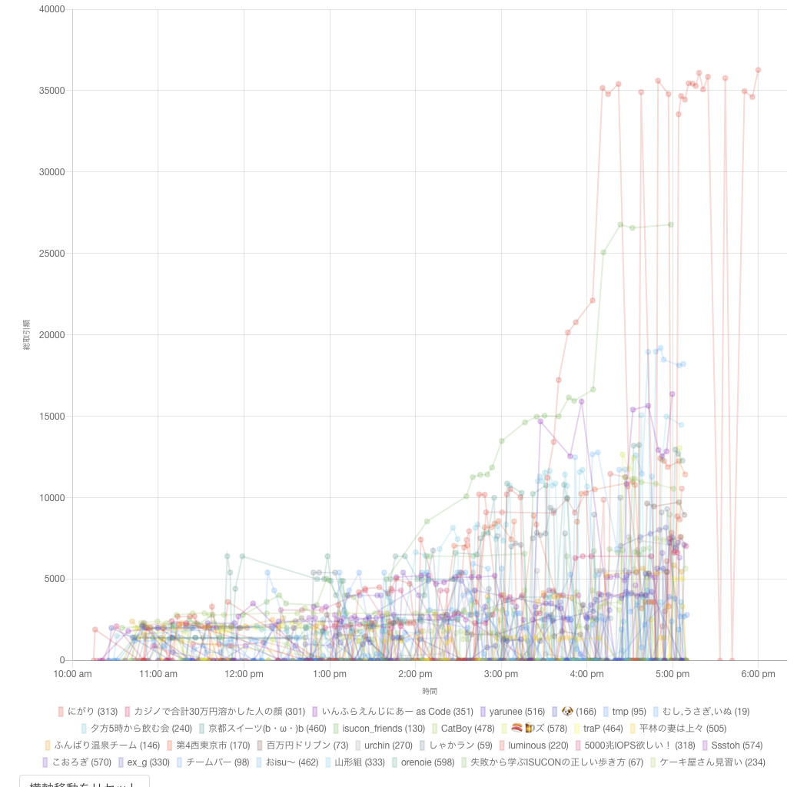
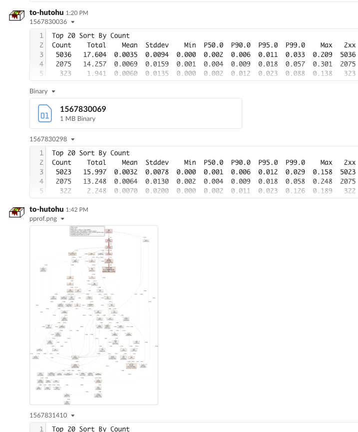

# ISUCON9予選1日目で最高スコアを出しました
[ISUCON9 オンライン予選 1日目の結果発表 : ISUCON公式Blog](http://isucon.net/archives/53786743.html)
[ISUCON9 オンライン予選 全てのチームのスコア（参考値） : ISUCON公式Blog](http://isucon.net/archives/53789925.html)


土曜日に行われたISUCON9予選にチームにがりとして参加し、1人チームで予選1日目の最高スコア及び予選全体で2番目のスコアを獲得しました。
つまり1日目1位だったので決勝に進む権利はあったのですが、後述の理由で決勝を辞退しています。そのためタイトルも順位ではなく「最高スコア」という表記にしています。



## 辞退した理由
[セキュリティの未来を生み出すU-25ハッカソン「セックハック365」| SecHack365](https://sechack365.nict.go.jp/)に参加しており、その集合イベントがちょうどISUCON決勝と被っていたからです。

もともと昨年組んでいたチーム(NaruseJun)での参加を予定していたのですが、出場登録前に日程的に決勝参加が難しいことに気づきチームを解散しました。(二人はそれぞれ別のチームで予選に参加していました)
それでも私がISUCONめちゃくちゃ好きなので、予選だけでも出よう、一人チームなら決勝進出争いには絡まないだろうという魂胆で結成した一人チームがにがりです。
チーム名の由来は自分のハンドルネームがとーふなのでそこからの連想ゲームです。

## 事前準備
所属しているサークル(https://trap.jp/)の友達のながてちが準備してくれたISUCON8予選の模擬を8月の終わりにやりました。
「模擬やりたいね〜」って言ったらシュッと準備して開催してくれたのでありがたい限りです。

模擬の様子は→ [部内ISUCONを開催しました | あれがながてち](https://blog.nagatech.work/post/isucon/561)

そこで得た知見を元に全体の動きとコンフィグをまとめたチートシートと、足りない手数を補うための秘伝のMakefileを作成しました。

[Makefile](https://github.com/tohutohu/isucon9/blob/master/Makefile)の機能としては

- `make setup`でgitの設定・必要な解析ツール(pt-query-digest, kataribe, myprofiler)・[slackcat](http://slackcat.chat/)のインストール
- `make slow-(on|off)`でスロークエリログの出力ON/OFF
- `make pprof`でpprofを取った後そのグラフ画像をSlackへ
- `make kataru`でkataribeでの解析結果をSlackへ
- `make slow`でpt-query-digestでの解析結果をSlackへ
- `make bench`でnginx・mysqlのログを対比させ再起動・Appの変更をcommitしビルドし再起動してログをtailする

という感じにしていました。
実際の競技中は`make bench`してベンチマークを開始、dstatなどの様子を見て負荷が上がってきたら`make pprof`、ベンチマークが終わったら`make kataru`、`make slow`して結果を見るという流れでした。



## 当日
当日使用したリポジトリは↓です。言語はGoを選択しました。
アプリケーションの再起動時に空でもコミットしているので、コミットログがひどいですがご容赦ください。
https://github.com/tohutohu/isucon9

開発はVSCode Remoteで直接サーバー内のファイルを編集していました。
ローカルでの開発とほぼ変わらない感覚で開発できるのは非常に楽でした。

### 開始まで〜直後
コンビニでRed Bullと2Lの水を買って研究室に入りました。
研究室は快適なネット環境とトリプルディスプレイにできる設備が整っているので最高です。

開始が10分遅れたのでその間に同じ建物で参加している他のチームの様子を見に行ったりしていました。

競技開始後すぐにインスタンスを立ててとりあえずベンチを回しました。
最初の正の点数のベンチマークが10:15:48なので5分くらいで準備ができたってことですね。

その後マニュアルを確認し3台起動できることがわかったのでコンソールから追加で2台を起動しました。

### テンプレートな動作
チートシートに書いてある通り作業を進めます。
やったことは
- Makefileの導入
- `make setup`
- Nginx秘伝のタレ導入
- MySQL秘伝のタレ導入
- カーネルパラメータ秘伝のタレ導入
- Makefileのビルド周りで必要な設定
- Gitリポジトリの作成・Push
- アプリケーション内で使われているSQLの抜き出し
- VSCode Remoteの設定


ここまでで40分くらいでした。

計測用のベンチマークを取って`make kataru`を行い、kataribe.tomlを調整してから解析をはじめました。
スロークエリログの方は解析結果が1MBもの巨大テキストファイルになってしまったので、今回見ることはありませんでした。

### 10:50 /users/transactions.jsonが遅い
```
Top 20 Sort By Total
Count    Total    Mean  Stddev    Min  P50.0  P90.0  P95.0  P99.0    Max  2xx  3xx  4xx  5xx  TotalBytes   MinBytes  MeanBytes   MaxBytes  Request
122  304.293  2.4942  1.8024  0.000  3.284  4.444  4.928  5.325  5.737  115    0    7    0     2239856          0      183594     24952  GET /users/transactions.json HTTP/2.0
 57  152.500  2.6754  1.4234  0.049  2.565  4.262  4.911  5.777  5.777   53    0    4    0     1148334          0      20146      22763  GET /users/transactions.json?created_at=<num>&item_id=<num> 
```
明らかに`/users/transactions.json`が遅いことがわかったので、そこを解決していくことにしました。
昨年までのチームでの戦略に沿ってまずは1台である程度まで高速化→複数台展開という想定で進めました。

### 11:10 indexを貼る → 2700
SQLをざっと見てそれっぽいところにインデックスを貼りました。
恥ずかしながらDBをよく理解しているわけではないので勘で貼っている部分も多々あります。(本当はEXPLAINとかで調べればいいんですが、面倒だったので…)
[index](https://github.com/tohutohu/isucon9/compare/a79ebd251f2a54d702bdfe9206caef732a60a21e...53250278aba3ed42e5df714cb725d0aff0641fd5#diff-9b7c3acec973ac3e913fc098d3b33016)


### 11:40 categoryとconfigのオンメモリキャッシュ → 3500
テンプレートな動作のところでSQLをざっと見て、CategoryとConfigにWriteがなく完全にオンメモリキャッシュができることがわかっていたのでまずはそれから実装しました。
Writeが一切ないのでrace conditionのことも考えなくてよく非常に楽に実装が済んでいます。
[Categoryのオンメモリキャッシュ](https://github.com/tohutohu/isucon9/compare/53250278aba3ed42e5df714cb725d0aff0641fd5...ced2ee032a055eba5c71e90da861812c832611ae#diff-10a40f961254d187b7cb202a0c22bca0)
[Configのオンメモリキャッシュ](https://github.com/tohutohu/isucon9/compare/ced2ee032a055eba5c71e90da861812c832611ae...fa99162bac3888a95b824403e9e526b8f0c56d8a)

### 13:04 4N+1を2N+1に → 3400
`/users/transactions.json`のハンドラの中では、`items`を取得してそのそれぞれの行に対して、`categories`,`users`,`transaction_evidences`,`shippings`へのクエリが飛んでおり4N+1になっていました。その中で`users`に関してはオンメモリキャッシュが可能そうでした。そのため(オンメモリになるとして)`categories`とともにN回してもそこまでボトルネックにはならないだろうと判断し、`items`と`transaction_evidences`,`shippings`をまとめるクエリを書きました。

[4N+1を2N+1に](https://github.com/tohutohu/isucon9/compare/fa99162bac3888a95b824403e9e526b8f0c56d8a...afec9fe4aed0d367dbe523f4960684e266b57b2c#diff-10a40f961254d187b7cb202a0c22bca0)

SQL苦手なので結構渾身の変更だったのですがあまり伸びず結構凹みました。

### 13:20 getUserSimpleByIDのキャッシュ → 4200
[getUserSimpleByIDのキャッシュ](https://github.com/tohutohu/isucon9/compare/afec9fe4aed0d367dbe523f4960684e266b57b2c...f962a6049d3af4eb4da42fb955a37fb2acf25d25#diff-10a40f961254d187b7cb202a0c22bca0)

### 13:30 細かい変更 → 4500
`/users/transactions.json`内が1クエリで済むようになったのでトランザクションを取る必要がなくなった(はず)なのでトランザクションを取らなくしました。
他の参加者の方の感想やブログを見ているとデッドロックに苦しめられていたチームも多かったのでここでうまく回避しているのかも知れません(ほんまか)

いつかの[インターンチャレンジ](https://twitcasting.tv/internship2018.php)でGoのHTTP Clientは同じホストへの接続本数が制限されていることを知ったことを思い出し、シュッと修正を入れました。

[txを取らなくした](https://github.com/tohutohu/isucon9/compare/f962a6049d3af4eb4da42fb955a37fb2acf25d25...6ae9e3b875f17be8298da31a00639f721327b7fd#diff-10a40f961254d187b7cb202a0c22bca0)
[接続本数修正](https://github.com/tohutohu/isucon9/compare/6ae9e3b875f17be8298da31a00639f721327b7fd...1aab2e75c8154442752377de2c849be47dc15c31)

### 13:40 キャンペーン開始 → 5000
ここらへんになってくるとCPUも帯域も空いているのに得点が伸びずウンウン唸るようになっていました。
インデックスを増やしたり、pprofを導入して変なことになっていないかなどを確認していました。
うわ〜〜ってなっていたところスッとキャンペーンの記述があったことを思い出したのは本当に奇跡だと思います。

[インデックス追加・pprof・キャンペーン開始](https://github.com/tohutohu/isucon9/compare/1aab2e75c8154442752377de2c849be47dc15c31...195d5e96e739fa26724e302a97bac64c42366d1b#diff-10a40f961254d187b7cb202a0c22bca0)

### 14:00 構成変更 getUserもオンメモリキャッシュに → 7400
Nginx+App, DBの2台構成に変更し、getUserもできそうだったのでオンメモリキャッシュにしました。

[構成変更・getUser](https://github.com/tohutohu/isucon9/compare/195d5e96e739fa26724e302a97bac64c42366d1b...b134ecf4f0363b37aa148f672e3be4065ef7ac72#diff-17cafee90d33f5fa3bb2ea7bde52b371)

### 14:45 Nginx+App, App, DBの3台構成に → 10000
dstatを見ているとDBの方はかなりCPUに余裕が出てきたにもかかわらず、AppがCPU100%ベタ付きでした。
そのためもう一台Appを増やすこととしました。
`categories`と`config`のキャッシュは2台目に`/initialize`のキャッシュのみを行うエンドポイントを生やし、1台目から叩くようにしました。
`users`のキャッシュは諦めます。

[3台構成に](https://github.com/tohutohu/isucon9/compare/b134ecf4f0363b37aa148f672e3be4065ef7ac72...f55e03ddd928143a50277ff425d5ee5dbd67f4c4#diff-10a40f961254d187b7cb202a0c22bca0)

### 15:00 小手先変更 → 変化なし
ここで一度万策尽きてしまいました。
pprofを見るとBcryptが支配的になってきていたのですが、しょうがないようなあと思いつつコストを下げました。
ただ、ベンチーマーカーからの新規ユーザーはほとんどなく効果はありませんでした。

万策尽きた時リストからUnixドメインソケット利用を思い出し実装を行いました。
[小手先](https://github.com/tohutohu/isucon9/compare/f55e03ddd928143a50277ff425d5ee5dbd67f4c4...e8b53b0b8fd9d6ac69a8bbe33e3dcfdf3f238d9a)

### 15:45 構成変更 → 22000
未だにBcryptが支配的なので流石にどうにかせねばと思い始めました。
ここで昨年のISUCON8の予選でレポートのエンドポイントだけを担うサーバーを作っていた感想ブログを思い出し、1台を`/login`専用にすることを思いつきました。
そうすれば`users`のオンメモリも可能となり得点を伸ばすことができそうです。

実装したら実際得点が伸びてビビりました。
順位表を確認すると1位になっており、ランキングを意識しだすようになります。

[構成変更](https://github.com/tohutohu/isucon9/compare/ca722458fd4976ffa8445fc4c42445f243f7e042...c2969f0832b807c0f12ae73eb401db3c9c435fa3#diff-10a40f961254d187b7cb202a0c22bca0)

### 16:10 APIの非同期化 → 35000
かなり改善をしたと思ったのですが、未だに`/users/transactions.json`が遅いです。
なんでかな〜と思いつつコードを辿っていると外部API呼び出しが同期的に呼び出されていることに気が付きました。
非同期にすれば早くなるじゃ〜んと思い実装。

[APIの非同期化](https://github.com/tohutohu/isucon9/compare/c2969f0832b807c0f12ae73eb401db3c9c435fa3...940c084529dfc68b1e57b8c5e289babb27c67816#diff-10a40f961254d187b7cb202a0c22bca0)

### その後 → 36270
その後は大きな改善点を見つけることができず、ちまちまとAPI呼び出しを直したり、`/login`のさばき方をいじったりしていました。
17時からは再起動試験をしました。17時40分になってRAMロールが適切に設定されていないことに気がついたときは心臓が止まるかと思いました。
最後にすべてのログ出力を止め、VSCode Remoteも切断しベンチを回しハイスコアがでたので終了。
最後のベンチは18時ピッタリくらいでした。(競技は18:10まで)

競技終了後、サークルの他のチームがやっていた講義室へ行き感想戦をしていました。
おisu〜が予選突破していて非常に嬉しいです。
[ISUCON9予選を1日目上位3位で通過しました | あれがながてち](https://blog.nagatech.work/post/isucon/587)

## 1人で戦ってどうだったか
文章にまとめるのが難しかったので箇条書きでまとめます。
- 自分だけですべて決まるので自分の実力がわかって楽しい
- コミュニケーションコストが0
- この実装はあとに残しておいて〜みたいなのができる
- 脳みそが1つしかないので自分で気づけないと辛い
- 勝ったときの喜びの分かち合いができない

特に脳みそが1つしかないという制限はかなり厳しかったと思います。
今回はたまたま自分がした改善がことごとくハマった形になりましたが、他のチームの戦略を見るとなんで思いつかなかったんだ…とめちゃくちゃ悔しい思いをしています。
外部APIのキャッシュとかBcrypt早い言語への切り替えとかそもそもBcryptからの乗り換えとか実装できる時間はあったのに…

ただ一人でもここまで戦えるんだという自信は付きました。
ISUCONだけですべてのエンジニア力が測れるわけではないのは当然わかっていますが、ISUCON9予選1日目という競技の中で1番を取れたことは自分のエンジニアとしての成長を感じて非常に嬉しいです。

## まとめ
今年の予選問題はボリュームもめちゃくちゃ大きかったのですが、Go Modulesが使われていたりMySQLのユーザーがちゃんと用意されていたりinit.shも環境変数を変えるだけで複数台構成に対応できたりとスピードアップ部分にフォーカスして取り組むことができて非常に快適でした。
運営の皆さん、本当にありがとうございました！！

来年こそはスケジュールをちゃんと確認して、決勝進出・優勝を目指したいですね。
